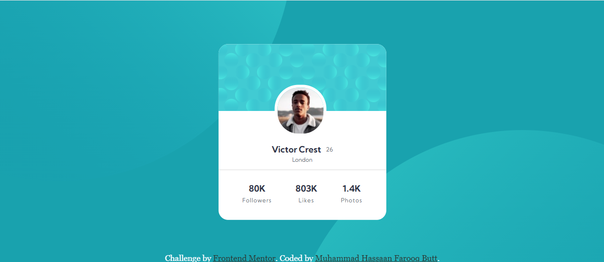

# Frontend Mentor - Profile card component solution

This is a solution to the [Profile card component challenge on Frontend Mentor](https://www.frontendmentor.io/challenges/profile-card-component-cfArpWshJ). Frontend Mentor challenges help us to improve our coding skills by building realistic projects.

## Table of contents

- [Overview](#overview)
  - [The challenge](#the-challenge)
  - [Screenshot](#screenshot)
  - [Links](#links)
- [My process](#my-process)
  - [Built with](#built-with)
  - [What I learned](#what-i-learned)
  - [Useful resources](#useful-resources)
- [Author](#author)
- [Acknowledgments](#acknowledgments)

## Overview

### The challenge

Users should be able to:

- View the optimal layout depending on their device's screen size

### Screenshot

### Links

- Solution URL: [Github solution URL here](https://github.com/MHassaanButt/profile-card-component)

- Live Site URL: [live site URL is here](https://mhassaanbutt.github.io/profile-card-component/)

## My process

### Built with

- Semantic HTML5 markup
- CSS custom properties
- Flexbox
- Mobile-first workflow
<!-- - [React](https://reactjs.org/) - JS library
- [Next.js](https://nextjs.org/) - React framework
- [Styled Components](https://styled-components.com/) - For styles -->

### What I learned

I learned the most important thing during solving challenge is that SASS is more usable and flexible to use instead of simple CSS. We can define varibles and functions I can maintain a proper hierarchy for our peoject. Flexbox makes work easy to design mobile layout and I suggest we always hav to go first for mobile design and then look for dekstop design.

### Useful resources

- [CSS-Tricks](https://css-tricks.com/) - This helped me for understanding flexbox and it's different properites. I really liked this pattern and will use it going forward.

## Author

- Frontend Mentor - [@MHassaanButt](https://www.frontendmentor.io/profile/MHassaanButt)
- Twitter - [@MHassaanButt](https://www.twitter.com/MHassaanButt)

## Acknowledgments

I am really thankful to [@usamakhangt4](https://github.com/usamakhangt4) who helped me through out the challenge and teach me SASS in detailed.
